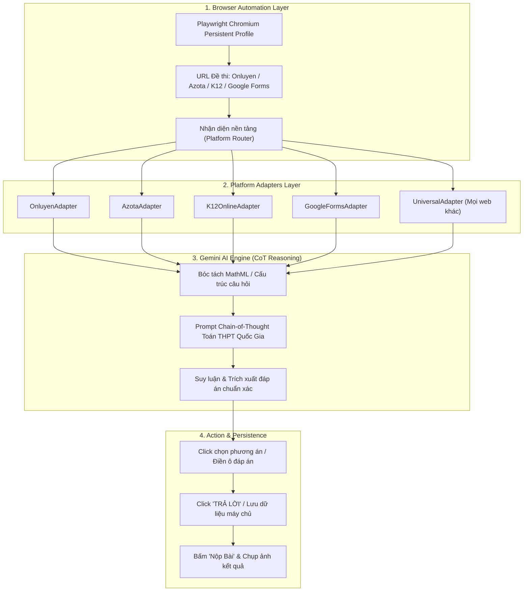

# 🎓 AutoEdu-Agent: Hệ Thống Tự Động Giải Bài Tập & Thi Trực Tuyến Đa Nền Tảng

<p align="center">
  
  
  
  
  
  
</p>

**AutoEdu-Agent** là hệ sinh thái tự động hóa giải bài tập và đề thi trực tuyến đa nền tảng kết hợp giữa **Trình duyệt tự động (Playwright / Browser-Use)** và **Trí tuệ nhân tạo (Gemini AI)** mà không phụ thuộc vào API Key trả phí.

Dự án được tối ưu hóa đặc biệt cho các **AI Coding Agent miễn phí** như **Cline**, **Google Antigravity**, **OpenCode**, **Cursor**, **Windsurf**, **Roo Code** và **Claude Code**.

---

## 🌐 Hỗ Trợ Đa Nền Tảng Giáo Dục (Universal Multi-Platform)

Hệ thống tích hợp bộ định tuyến tự động (`autoedu.platforms`), có khả năng nhận diện URL và giải đề trên **TẤT CẢ** các nền tảng phổ biến:

| Nền tảng | Trạng thái | Tính năng nổi bật |
| :--- | :---: | :--- |
| **Onluyen.vn** | ✅ Sẵn sàng | Hỗ trợ trọn vẹn 3 phần thi, bóc tách MathML, đồng bộ phiếu trả lời |
| **Azota.vn** | ✅ Sẵn sàng | Tự động nhận diện câu hỏi trắc nghiệm, click chọn A-B-C-D và nộp bài |
| **K12Online** | ✅ Sẵn sàng | Tự động vào phòng thi Viettel K12Online, giải và hoàn thành |
| **Google Forms** | ✅ Sẵn sàng | Tự động giải form bài kiểm tra Google Docs (trắc nghiệm + điền số) |
| **Universal Web** | ✅ Sẵn sàng | Phân tích DOM vạn năng cho **OLM.vn, VnEdu LMS, Submoi, VietJack, Quizizz...** |

---

## 🎁 Chế Độ Dùng Thử 1 Lần Duy Nhất (1-Time Free Trial)

Nhằm giúp các nhà phát triển và người dùng trải nghiệm ngay mà không phải mất thời gian cấu hình cookies:
- **Tự động kích hoạt lượt dùng thử miễn phí (1/1)** cho lần chạy đầu tiên trên mỗi thiết bị.
- Hỗ trợ chạy trực tiếp thông qua các AI Agent miễn phí:
  ```bash
  # Xem trạng thái cấu hình và hạn mức trial
  python cli.py status

  # Chạy bài thi dùng thử 1 lần duy nhất trên bất kỳ nền tảng nào (không cần file .env)
  python cli.py trial --url "<LINK_BAI_THI_ONLUYEN_HOAC_AZOTA_HOAC_GOOGLE_FORMS>"
  ```
- **Cam kết an toàn 100%**: File `.env` chứa cookie của bạn được bảo vệ nghiêm ngặt trong máy cục bộ, không bao giờ bị đẩy lên GitHub hay chia sẻ ra bên ngoài.

---

## 🎯 Đột Phá Nâng Cao Độ Chính Xác (High Accuracy Engine)

1. **Quy trình Suy luận Từng bước (Chain-of-Thought)**:
   - Mô hình AI được định hướng suy luận từng bước (viết rõ công thức, tập xác định, tính toán chi tiết và loại trừ phương án sai) trước khi kết luận đáp án.
   - Giúp nâng cao tỷ lệ giải đúng các bài toán phức tạp (Hình học Oxyz, khảo sát hàm số, tiệm cận, bảng biến thiên, hóa hữu cơ).

2. **Bộ bóc tách MathML v2 & Chuẩn hóa Ký hiệu Toán học**:
   - Chuyển đổi toàn diện các cấu trúc toán học từ MathJax:
     - Vectơ: `<mover>` -> `vec(AB)`
     - Giới hạn: `<munder>` -> `lim_(x->+inf)`
     - Căn thức: `<mroot>`, `<msqrt>` -> `root(3, x)`, `sqrt(x)`
     - Bảng biến thiên, ma trận, hệ phương trình: `<mtable>`, `<mtr>`, `<mtd>` -> `[Hàng: x | y' | y]`
     - Chuẩn hóa ký hiệu: vô cực ($\infty$), tập hợp ($\in, \cup, \cap$), dấu trừ âm ($-$).

3. **Cơ chế Lưu bài & Đồng bộ Chắc Chắn**:
   - Bắt buộc click nút **`TRẢ LỜI`** sau mỗi câu và tự động retry kiểm tra nhãn `done` trên phiếu trước khi qua câu mới.
   - Đảm bảo 100% dữ liệu được lưu lên máy chủ máy chấm thi.

---

## 🏗 Kiến Trúc Hệ Thống



---

## 📁 Cấu Trúc Thư Mục

```
AutoEdu-Agent/
├── autoedu/                        # Gói thư viện cốt lõi
│   ├── ai/
│   │   ├── gemini_web.py           # Client kết nối Gemini (Web Cookies / Free API)
│   │   └── prompts.py              # Template prompt Chain-of-Thought độ chính xác cao
│   ├── browser/
│   │   ├── context.py              # Quản lý Chromium & profile lưu phiên
│   │   └── navigator.py            # Quét danh sách bài tập cần làm
│   ├── extractor/
│   │   └── mathml_parser.py        # Bộ chuyển đổi MathML v2 sang văn bản toán
│   ├── platforms/                  # Kiến trúc hỗ trợ đa nền tảng
│   │   ├── base.py                 # Lớp cơ sở BasePlatformAdapter
│   │   ├── onluyen.py              # Adapter Onluyen.vn
│   │   ├── azota.py                # Adapter Azota.vn
│   │   ├── k12online.py            # Adapter K12Online
│   │   ├── google_forms.py         # Adapter Google Forms
│   │   └── universal.py            # Adapter vạn năng cho mọi web LMS khác
│   ├── solver/
│   │   ├── handlers.py             # Xử lý từng dạng câu hỏi (I, II, III)
│   │   └── runner.py               # Vòng lặp giải đề & nộp bài tự động
│   ├── trial.py                    # Quản lý chế độ Dùng Thử 1 Lần Duy Nhất
│   └── config.py                   # Quản lý biến môi trường
├── skills/
│   └── autoedu-solver/
│       └── SKILL.md                # Skill chuẩn cho Antigravity / Claude Code
├── .clinerules                     # Cấu hình tối ưu cho Cline / Roo Code (VS Code)
├── opencode.json                   # Cấu hình lệnh cho OpenCode CLI
├── .cursorrules                    # Cấu hình cho Cursor AI & Windsurf
├── CLAUDE.md                       # Hướng dẫn cho Claude Code
├── cli.py                          # Giao diện dòng lệnh CLI (solve, trial, status, scan)
├── .env.example                    # File mẫu cấu hình cookies & tài khoản
├── .gitignore                      # Bảo vệ thông tin bí mật và file rác
├── requirements.txt                # Danh sách thư viện Python
├── pyproject.toml                  # Cấu hình cài đặt gói
├── LICENSE                         # Giấy phép MIT
└── README.md                       # Tài liệu hướng dẫn
```

---

## 🚀 Cài Đặt & Sử Dụng

### 1. Cài đặt môi trường
Yêu cầu Python >= 3.11:

```bash
# Tạo môi trường ảo
python -m venv .venv

# Kích hoạt môi trường (Windows PowerShell)
.venv\Scripts\Activate.ps1

# Cài đặt thư viện phụ thuộc
pip install -r requirements.txt

# Cài đặt browser binary Playwright
playwright install chromium
```

### 2. Dùng thử ngay trên bất kỳ ứng dụng nào (Không cần cấu hình)
```bash
python cli.py trial --url "https://app.onluyen.vn/school/test/<ID_BÀI_THI>"
# hoặc
python cli.py trial --url "https://azota.vn/vi/test/<ID_BÀI_THI>"
# hoặc
python cli.py trial --url "https://docs.google.com/forms/d/e/<FORM_ID>/viewform"
```

### 3. Mở khóa vĩnh viễn (Cấu hình Cookie Gemini Web Miễn Phí)
1. Mở Chrome truy cập [gemini.google.com](https://gemini.google.com).
2. Nhấn `F12` -> Chọn tab **Application** (Ứng dụng) -> **Cookies** -> `https://gemini.google.com`.
3. Tìm và sao chép 3 cookie:
   - `__Secure-1PSID`
   - `__Secure-1PSIDTS`
   - `__Secure-1PSIDCC`
4. Tạo file `.env` từ `.env.example` và dán vào:

```env
GEMINI_SECURE_1PSID=g.a000...
GEMINI_SECURE_1PSIDTS=sidts-...
GEMINI_SECURE_1PSIDCC=AKEy...

# (Tùy chọn) Hoặc dùng Free API Key từ Google AI Studio:
# GEMINI_API_KEY=AIzaSy...

# (Tùy chọn) Tài khoản Onluyen để tự động đăng nhập nếu hết phiên:
ONLUYEN_USERNAME=your_username
ONLUYEN_PASSWORD=your_password
```

---

## 🖥 Hướng Dẫn Sử Dụng CLI

### Xem trạng thái hệ thống & lượt dùng thử
```bash
python cli.py status
```

### Kiểm tra kết nối AI
```bash
python cli.py test-ai
```

### Tự động giải và nộp bài kiểm tra trên mọi nền tảng
```bash
# Giải bài Onluyen
python cli.py solve --url "https://app.onluyen.vn/school/test/<ID>"

# Giải đề Azota
python cli.py solve --url "https://azota.vn/vi/test/<ID>"

# Giải Google Forms
python cli.py solve --url "https://docs.google.com/forms/d/e/<FORM_ID>/viewform"

# Giải đề K12Online
python cli.py solve --url "https://k12online.vn/bai-thi/<ID>"
```
*(Thêm `--headless` nếu muốn chạy ẩn không mở cửa sổ Chrome)*

---

## 🤖 Tích Hợp Vào Các AI Coding Agent

Dự án cung cấp sẵn cấu hình cho mọi nền tảng Agent phổ biến:
- **Cline & Roo Code**: Đã có sẵn [`.clinerules`](.clinerules). Bạn chỉ cần mở VS Code và ra lệnh cho Cline: `"Hãy quét bài tập trên Onluyen và làm giúp tôi"`.
- **OpenCode**: Đã có sẵn [`opencode.json`](opencode.json). Hỗ trợ trực tiếp các lệnh `status`, `scan`, `trial`, `solve`.
- **Google Antigravity / Claude Code**: Đã có sẵn [`skills/autoedu-solver/SKILL.md`](skills/autoedu-solver/SKILL.md) và [`CLAUDE.md`](CLAUDE.md).
- **Cursor & Windsurf**: Đã có sẵn [`.cursorrules`](.cursorrules).

---

## 🌙 Tự Động Hóa Hẹn Giờ 22:00 Hàng Ngày & Thông Báo Mobile

Hệ thống hỗ trợ tự động rà soát và giải bài tập về nhà mỗi đêm với cơ chế chạy ngầm (Headless) và báo cáo kết quả:

### 1. Kích hoạt bộ hẹn giờ tự động
```bash
# Chạy trực tiếp 1 lần để kiểm tra
python auto_nightly_worker.py

# Hoặc cài đặt tự động vào Windows Task Scheduler chạy 22:00 mỗi tối:
powershell -ExecutionPolicy Bypass -File cai_dat_hen_gio_10h_toi.ps1
```
* **Tính năng:**
  - `WakeToRun`: Tự động đánh thức máy từ chế độ Sleep.
  - `StartWhenAvailable`: Chạy bù ngay khi bật máy nếu lúc 22:00 máy đang tắt.

### 2. Gửi thông báo & bảng điểm về Discord / Telegram
- **Discord:** Cấu hình `DISCORD_WEBHOOK_URL` trong `.env`. Hệ thống sẽ tự động chụp ảnh màn hình bảng điểm và gửi Rich Embed card về kênh Discord trên điện thoại.
- **Telegram:** Cấu hình `TELEGRAM_BOT_TOKEN` và `TELEGRAM_CHAT_ID` trong `.env`. Hỗ trợ bot tương tác 2 chiều (`/status`, `/homework`).

### 3. Theo dõi tiến trình từ xa qua điện thoại (Live Monitor)
```bash
python antigravity_mobile_monitor.py
```
Mở trình duyệt điện thoại truy cập `http://<IP_MAY_TINH>:7860` để xem trạng thái thời gian thực.

---

## 📜 Giấy Phép & Tuyên Bố Miễn Trừ Trách Nhiệm

- Dự án phát hành theo giấy phép [MIT License](LICENSE).
- Công cụ được phát triển phục vụ mục đích nghiên cứu công nghệ tự động hóa kiểm thử web (E2E Web Automation) và ứng dụng LLM trong hỗ trợ học tập. Người dùng tự chịu trách nhiệm khi sử dụng công cụ trên các nền tảng thực tế.
