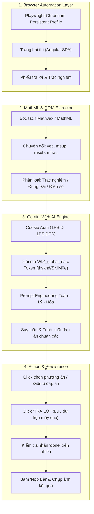

# 🎓 AutoEdu-Agent: Hệ Thống Tự Động Giải Bài Tập & Thi Trực Tuyến

<p align="center">
  
  
  
  
</p>

**AutoEdu-Agent** là hệ thống tự động hóa giải bài tập và bài thi trực tuyến (tiêu chuẩn Onluyen.vn) kết hợp giữa **Trình duyệt tự động (Playwright / Browser-Use)** và **Trí tuệ nhân tạo (Gemini Web AI)** mà không phụ thuộc vào API Key trả phí.

Dự án được đóng gói dưới dạng **Repo độc lập** kèm **Plugin/Skill chuẩn cho AI Coding Assistant (Antigravity, Claude Code)**.

---

## 🏗 Kiến Trúc Hệ Thống



---

## ⚡ Các Điểm Đột Phá Kỹ Thuật

1. **Gemini Web Reverse-Engineering (Miễn phí 100%)**:
   - Sử dụng phiên cookie trình duyệt Google (`__Secure-1PSID`, `__Secure-1PSIDTS`, `__Secure-1PSIDCC`).
   - Tự động bóc tách mã bảo vệ CSRF từ `window.WIZ_global_data` (hỗ trợ cấu trúc mới nhất của Google cập nhật cuối năm 2026: `thykhd` / `SNlM0e` / tiền tố `AFWL...`).
   - Hoạt động ổn định với tốc độ suy luận dưới 2 giây/câu hỏi.

2. **Trích xuất Công thức Toán học & Hóa học (MathML Parser)**:
   - Thay vì đọc text thô bị lỗi xuống dòng từ MathJax, hệ thống chuyển đổi trực tiếp cây DOM MathML:
     - `<mover>` -> `vec(AB)` (Vector)
     - `<msup>`, `<msub>`, `<msubsup>` -> `a^2`, `x_1`, `C_2H_5OH`
     - `<mfrac>` -> `(tử số)/(mẫu số)`
     - `<msqrt>` -> `sqrt(biểu thức)`
   - Giúp mô hình ngôn ngữ hiểu chính xác 100% đề bài toán học và phản ứng hóa học.

3. **Cơ chế Đồng bộ Hóa Angular SPA & Lưu Điểm Chắc Chắn**:
   - Tránh lỗi thường gặp khi bot chỉ click radio button nhưng hệ thống Onluyen chưa ghi nhận.
   - Bắt buộc thực hiện thao tác click **`TRẢ LỜI`** sau mỗi câu và kiểm tra class `done` trên phiếu trước khi chuyển sang câu tiếp theo.

4. **Xử lý Toàn diện 3 Dạng Đề Thi Chuẩn Mới**:
   - **Phần I**: Trắc nghiệm 4 lựa chọn (A, B, C, D).
   - **Phần II**: Đúng / Sai 4 mệnh đề độc lập (a, b, c, d).
   - **Phần III**: Trả lời ngắn / Điền số (tự động chuẩn hóa dấu phẩy thập phân `,` và dấu `-`).

---

## 📁 Cấu Trúc Thư Mục

```
AutoEdu-Agent/
├── autoedu/                        # Gói thư viện cốt lõi
│   ├── ai/
│   │   ├── gemini_web.py           # Client kết nối Gemini Web không cần API Key
│   │   └── prompts.py              # Template prompt tối ưu cho Toán, Hóa, Lý
│   ├── browser/
│   │   ├── context.py              # Quản lý trình duyệt Chromium & profile
│   │   └── navigator.py            # Quét danh sách bài tập cần làm
│   ├── extractor/
│   │   └── mathml_parser.py        # Bộ chuyển đổi MathML sang văn bản toán
│   ├── solver/
│   │   ├── handlers.py             # Xử lý từng dạng câu hỏi (I, II, III)
│   │   └── runner.py               # Vòng lặp giải đề & nộp bài tự động
│   └── config.py                   # Quản lý biến môi trường
├── skills/
│   └── autoedu-solver/
│       └── SKILL.md                # Định nghĩa Skill cho Antigravity / Claude Code
├── cli.py                          # Giao diện dòng lệnh CLI
├── .env.example                    # File mẫu cấu hình cookies & tài khoản
├── .gitignore                      # Bảo vệ thông tin bí mật và file rác
├── requirements.txt                # Danh sách thư viện Python
├── pyproject.toml                  # Cấu hình cài đặt gói
├── LICENSE                         # Giấy phép MIT
└── README.md                       # Tài liệu hướng dẫn
```

---

## 🚀 Cài Đặt & Sử Dụng

### 1. Cài đặt môi trường
Yêu cầu Python >= 3.11:

```bash
# Tạo môi trường ảo
python -m venv .venv

# Kích hoạt môi trường (Windows PowerShell)
.venv\Scripts\Activate.ps1

# Cài đặt thư viện phụ thuộc
pip install -r requirements.txt

# Cài đặt browser binary Playwright
playwright install chromium
```

### 2. Cấu hình Cookie Gemini Web
1. Mở trình duyệt Chrome và truy cập [gemini.google.com](https://gemini.google.com).
2. Nhấn `F12` -> Chọn tab **Application** (Ứng dụng) -> **Cookies** -> `https://gemini.google.com`.
3. Tìm và sao chép giá trị của các cookie:
   - `__Secure-1PSID`
   - `__Secure-1PSIDTS`
   - `__Secure-1PSIDCC`
4. Tạo file `.env` từ `.env.example` và dán vào:

```env
GEMINI_SECURE_1PSID=g.a000...
GEMINI_SECURE_1PSIDTS=sidts-...
GEMINI_SECURE_1PSIDCC=AKEy...

# (Tùy chọn) Tài khoản Onluyen để tự động đăng nhập nếu hết phiên:
ONLUYEN_USERNAME=your_username
ONLUYEN_PASSWORD=your_password
```

---

## 🖥 Hướng Dẫn Sử Dụng CLI

### Kiểm tra kết nối Gemini AI
```bash
python cli.py test-ai
```

### Quét danh sách bài tập đang giao trên Onluyen
```bash
python cli.py scan
```

### Tự động giải và nộp bài kiểm tra
```bash
# Mở cửa sổ trình duyệt trực tiếp để quan sát:
python cli.py solve --url "https://app.onluyen.vn/school/test/<ID_BÀI_THI>"

# Hoặc chạy ngầm (Headless):
python cli.py solve --url "https://app.onluyen.vn/school/test/<ID_BÀI_THI>" --headless
```

---

## 🤖 Tích Hợp Vào AI Agent (Plugin / Skill)

Dự án cung cấp tệp định nghĩa Skill tại [skills/autoedu-solver/SKILL.md](skills/autoedu-solver/SKILL.md).
Bạn có thể tích hợp trực tiếp vào **Google Antigravity** hoặc **Claude Code**:

1. Sao chép thư mục `skills/autoedu-solver` vào thư mục `.agents/skills/` hoặc `.gemini/skills/`.
2. Ra lệnh cho AI:
   > *"Hãy kiểm tra các bài tập còn lại trên Onluyện và hoàn thành giúp tôi."*
   > *"Tự động làm đề kiểm tra Toán tại link này: https://app.onluyen.vn/school/test/..."*

AI Assistant sẽ tự động kích hoạt kỹ năng này, mở trình duyệt, điều khiển giao diện và nộp bài hoàn chỉnh.

---

## 📜 Giấy Phép & Tuyên Bố Miễn Trừ Trách Nhiệm

- Dự án phát hành theo giấy phép [MIT License](LICENSE).
- Công cụ được phát triển phục vụ mục đích nghiên cứu công nghệ tự động hóa kiểm thử web (E2E Web Automation) và ứng dụng LLM trong hỗ trợ học tập. Người dùng tự chịu trách nhiệm khi sử dụng công cụ trên các nền tảng thực tế.
